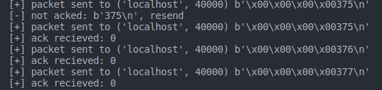

# Network Practical 4 - GreatUDP
## Erfan Mojibi - 99105707

### How code works
In order to make udp reliable, I added seq number to udp packets in data segment before the main data.
For each packet I wait for ack to be recieved and I won't send next packet unless the previous ack is recieved.

In sender main Program is multithreaded:
  
  * One reciever thread that gets packets and buffers them in a queue.

  * One Sender thread that reads from queue, sends packet, waits for ack and resends if not acked.


In reciever we only ack each recieved packet and then forward it to target destination.

Program working images when `DEBUG=TRUE`:

 * Commands:

```Bash:
./lossy_link-linux 127.0.0.1:40000 127.0.0.1:50001

ncat --recv-only -u -l 54321

python3 sender.py

python3 reciever.py

seq 1000 | { while read; do sleep 0.01; echo "$REPLY"; done; } | ncat --send-only -u 127.0.0.1 12345

```



### How to run
We need to run both sender and reciever files.

* sender sends packets to lossy link. you can config it with calling main function as follows:
```python
    # main (source of data, lossy link)
    main(('localhost', 12345), ('localhost', 40000))
```

* reciever gets packets from lossy link, checks them and send for main listener if valid. you can config it with calling main function as follows:
```python
    # main (listen address as lossy link destination, main data reciever address)
    main(('localhost', 54321), ('localhost', 50001))
```

you can run 3 core programs with following make commands and send & recieve data with your prefered ncat commands:

```bash
    make lossy_link

    make sender

    make reciever
```