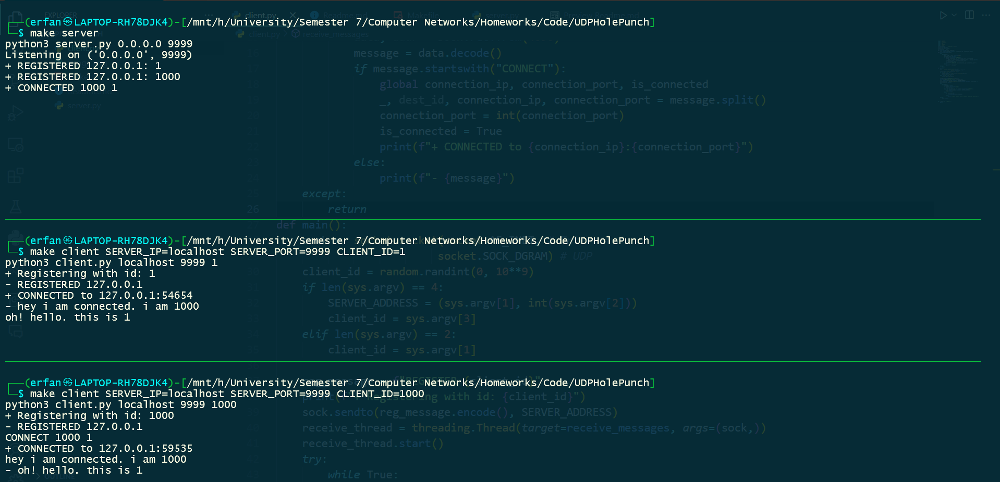

# Erfan Mojibi - 99105707
# UDP Hole Punch


## client.py

The client.py script implements a UDP client that can connect to other clients using a server-based hole punching mechanism. It uses a socket for UDP communication and relies on the server to facilitate the connection between clients.

### Key Functions:

* ``send_message(sock, command)``: This function sends a message to the specified destination client. It takes the socket object sock and the command message as arguments.

* ``receive_messages(sock)``: This function continuously listens for incoming messages from other clients or the server. It uses a separate thread to handle message reception, allowing the main thread to handle user input and other tasks.

* ``main()``: This is the main function that initializes the client and handles user interactions. It creates a socket, registers the client with the server, and then enters a loop to listen for user commands.

### User Commands:

1. **REGISTER [id]**: This command registers the client with the server using the specified id. The server will respond with "REGISTERED" message along with the client's public IP address. It is executed at the beginning of program without need of user entering it.

2. **CONNECT [my_id] [dest_id]**: This command attempts to connect to the specified dest_id client. The server will relay the connection request to the destination client, and if successful, both clients will be notified with a "CONNECTED to [ip]:[port]".

## server.py

The server.py script implements a UDP server that acts as a central hub for managing client connections. It maintains a dictionary of registered clients and handles connection requests.

Key Functions:

1. ``main()``: This is the main function that initializes the server socket and enters a loop to receive messages from clients and the server.In the loop, it handles incoming messages from clients and the server. It parses the message, extracts the relevant information, and takes appropriate actions based on the message type.

### Message Types:

1. **REGISTER [id]**: The server registers the client with the specified id and stores the client's public IP address and port in the clients dictionary. It responds with "REGISTERED" message along with the client's public IP address.

2. **CONNECT [src_id] [dest_id]**: The server receives a connection request from src_id client to dest_id client. It retrieves the public IP addresses and ports of both clients from the clients dictionary, constructs a connection message, and sends it to both clients.

## How it works:

1. **Start the Server**: Run the server.py script from the command line. You can specify server interfaces you want to listen on with `SERVER_ADDRESS` in code.

2. **Start Clients**: Run the client.py script for each client, specifying the server's IP address and port number, and the client's unique identifier. For example, to run a client on the same machine as the server, use the command: ``python client.py localhost 9999 12345``

3. **Register Clients**: Each client is registered with the server using the "REGISTER" command followed by their assigned ID. For example, the client with ID 12345 would use the command: REGISTER 12345. It is done implicitly by running code and you don't need to do anything.

4. **Establish Connections**: After registration, clients can connect to each other using the "CONNECT" command. For example, the client with ID 12345 to connect to another client with ID 56789 would use the command: CONNECT 12345 56789

5. **Send Messages**: Once connected, clients can exchange messages using the standard UDP communication paradigm.

This UDP hole punching mechanism allows clients behind NATs to establish direct communication without requiring port forwarding or special configurations on the network.

## Notes
* Error handling is minimal, and the code may not handle all edge cases gracefully.
* Server deletes connected clients ids from its dictionary.

## How it runs
1. On server, run: 
   ```
   make server
   ``` 
   or 
   ```
   make server SERVER_IP=[interface ip] SERVER_PORT=[port]
   ```
2. On clients, run:
   ```
   make client SERVER_IP=[server ip] SERVER_PORT=[server port] CLIENT_ID=[id you want to get]
   ```
3. You can now communicate!
   
    